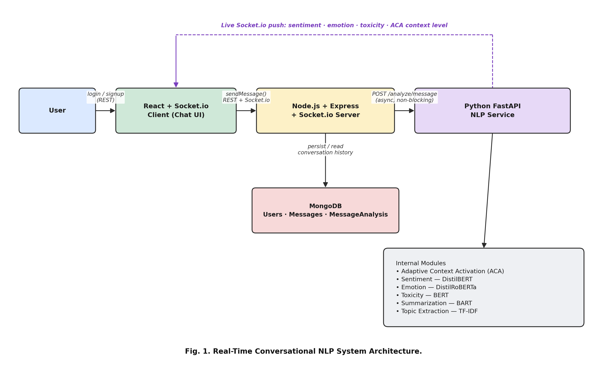
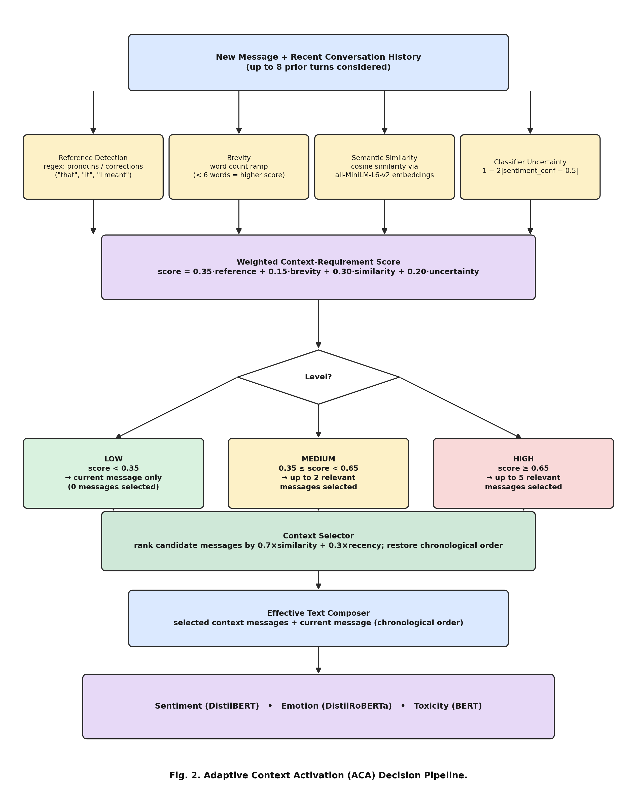
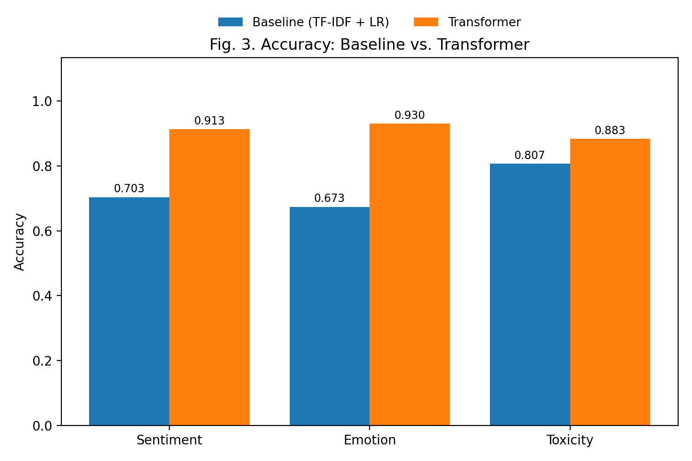
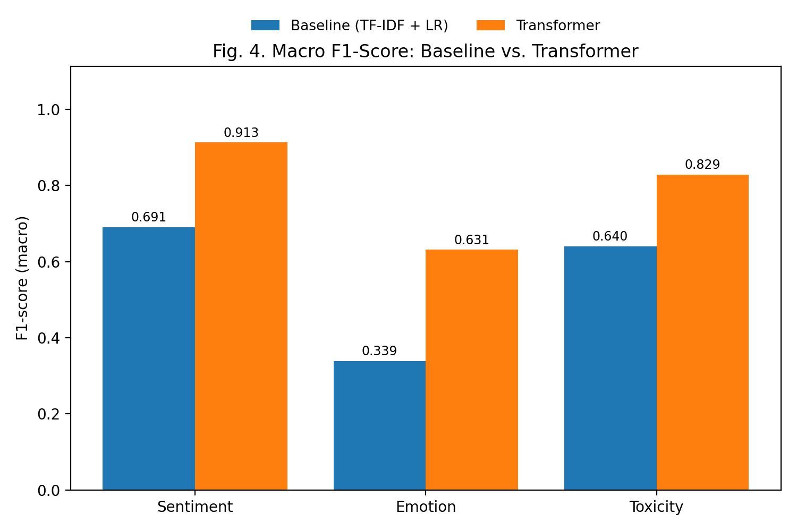
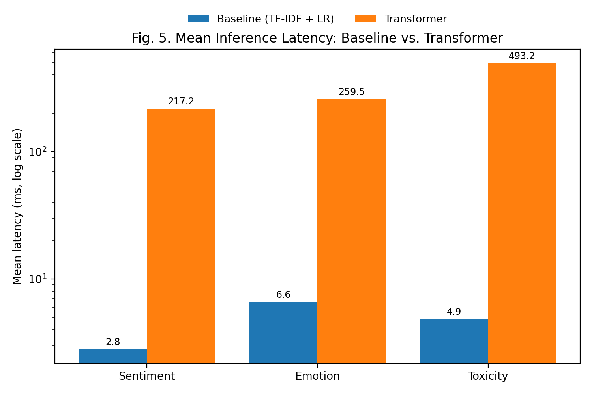
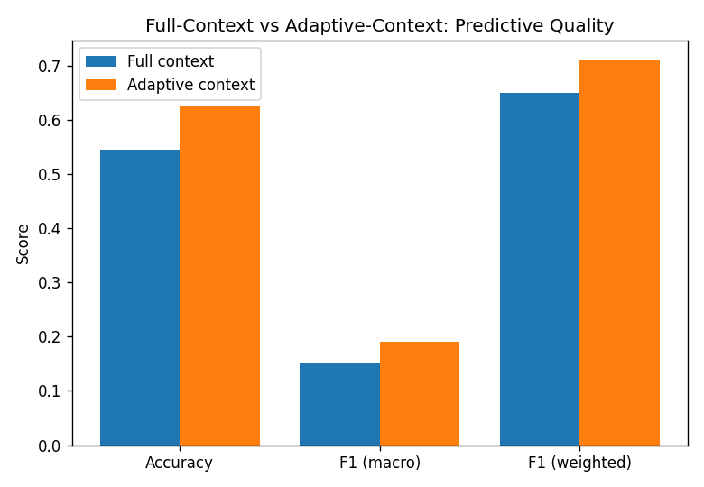
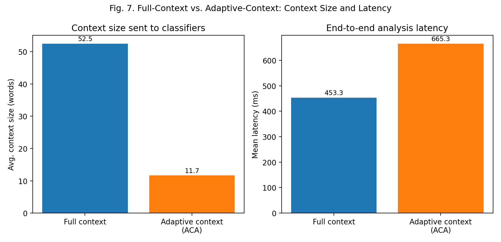
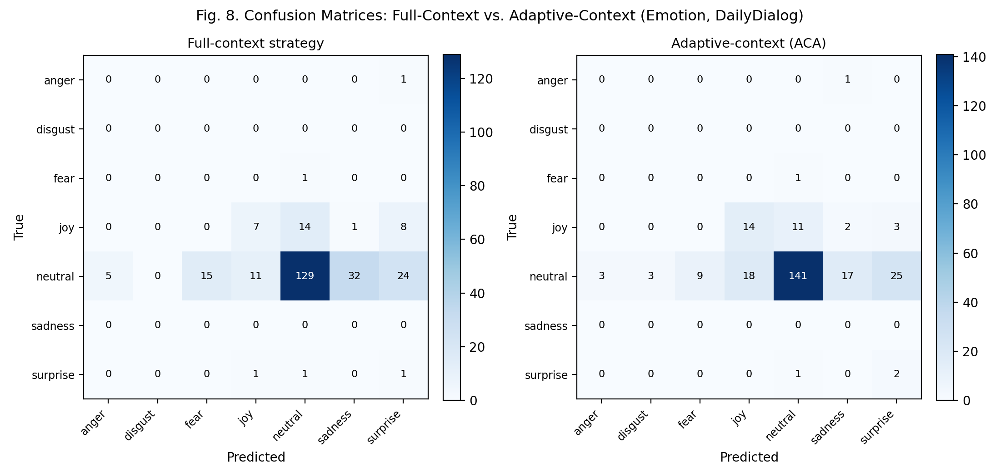

# Research Paper Draft — Copy/Paste Source

> **How to use this file:** each `##` section below corresponds to one section of the
> IEEE-style paper template you're following. As you send me more reference
> screenshots (Introduction, Related Work, Methodology, Results, etc.), I will
> keep appending/refining sections here in the same order. When a section is
> finalized, copy its content (not the heading markup) directly into your Word
> document. Every number quoted anywhere in this document is taken directly
> from `experiments/FINDINGS.md` / `experiments/results/` — nothing here is
> invented, rounded misleadingly, or estimated.
>
> **Working title (placeholder — replace once you decide on a final title):**
> "A Multi-Module NLP System for Real-Time Conversational Analysis with
> Adaptive Context Activation"

---

## Abstract

*Abstract*—Real-time conversational platforms predominantly focus on message
exchange rather than understanding the content and context of a conversation,
and systems that do provide intelligent analysis typically address a single
task using a fixed, non-selective context window regardless of whether a
message actually depends on prior turns. This paper presents a Multi-Module
Natural Language Processing (NLP) system for real-time conversational
analysis that integrates sentiment, emotion, toxicity, summarization, and
topic extraction into a single asynchronous pipeline within a real-time chat
application. Its central contribution is Adaptive Context Activation (ACA),
an interpretable algorithm that scores each incoming message on four weighted
signals, namely reference detection, message brevity, semantic similarity to
recent history, and classifier uncertainty, and selects only the most
relevant prior messages by combining semantic similarity with recency, rather
than using a fixed recent-message window. On public benchmark datasets,
pretrained Transformer models outperform a TF-IDF and Logistic Regression
baseline across all three classification tasks, reaching 91.3 percent
accuracy for sentiment against 70.3 percent for the baseline, 93.0 percent
against 67.3 percent for emotion, and 88.3 percent against 80.7 percent for
toxicity. On a real multi-turn dialogue benchmark, ACA is further shown to
improve predictive quality over a full-context strategy, raising accuracy
from 54.6 percent to 62.5 percent and macro F1-score from 0.151 to 0.191,
while reducing the average context sent to downstream models by 77.8 percent,
from 52.5 words to 11.7 words. This gain carries a measured latency cost,
since the context-selection step itself, dominated by sentence-embedding
computation, adds more overhead than it saves on the CPU-only evaluation
setup used. The system is deployed as a complete, working prototype spanning
a Node.js and Socket.io backend, a MongoDB persistence layer, a FastAPI-based
Python inference service, and a React frontend, demonstrating that adaptive,
signal-driven context selection is a measurable design trade-off rather than
an assumed improvement.

*Keywords*—Natural Language Processing, Adaptive Context Selection,
Sentiment Analysis, Emotion Detection, Toxicity Detection, Conversational
Intelligence, Real-Time Systems

---

## I. Introduction

> **Note before copying:** the bracketed markers `[CITATION NEEDED]` below mark
> claims that a real paper would support with a literature reference (the way
> your friend's paper cites OWASP and prior prompt-injection work). I have not
> fabricated any references — please replace each marker with a real citation
> to a paper/source you've actually read (e.g., for BERT/DistilBERT/RoBERTa,
> for prior sentiment/toxicity-analysis chatbot systems, and for prior
> context-window or retrieval-augmented approaches). Everything else in this
> section describes only what this project actually built and measured.

Real-time messaging has become one of the primary modes of digital
communication, spanning personal conversations, customer support, and
collaborative professional work. Advances in Natural Language Processing
(NLP), particularly the emergence of pretrained Transformer models such as
BERT, DistilBERT, and RoBERTa [1]–[3], have made it computationally
practical to analyze the content of a conversation, not merely deliver it,
even in real time and on modest hardware. Sentiment analysis, emotion
recognition, toxicity detection, and automatic summarization can now run
continuously alongside a live conversation rather than as an offline, batch
process.

However, most existing conversational platforms still treat messaging purely
as an exchange problem: messages are delivered and stored, but their content
and context are rarely understood. Where intelligent analysis is offered at
all, it is typically limited to a single, isolated task, most commonly
sentiment analysis, and conversational context is handled naively
[CITATION NEEDED]. Two common but flawed strategies dominate current
practice: either a fixed number of preceding messages is sent to every
downstream model regardless of whether the current message actually depends
on that history, wasting computation and potentially diluting a classifier's
input with irrelevant text, or no history is used at all, causing genuinely
context-dependent messages, such as short corrections, pronoun references
("that", "it", "they"), or one-word acknowledgments, to be misclassified.

Not every message carries the same conversational dependency. A message such
as "Thanks!" can usually be interpreted on its own, whereas a message such as
"No, I meant the other results." cannot be understood without knowing what
"the other results" refers to. Treating both cases identically, whether by
always using a fixed context window or never using one at all, is an
inefficient and imprecise design choice that existing systems have largely
left unexamined and unmeasured.

To address this gap, this paper presents a Multi-Module NLP System for
real-time conversational analysis, in which sentiment, emotion, toxicity,
summarization, and topic extraction operate as independent, asynchronous
modules over a live chat pipeline. The central contribution is Adaptive
Context Activation (ACA), an interpretable algorithm that computes a
context-requirement score for every incoming message from four weighted
signals, namely reference detection, message brevity, semantic similarity to
recent conversation history, and classifier uncertainty, and then selects
only the most relevant preceding messages, ranked by a combination of
semantic similarity and recency, rather than a fixed recent-message window.
ACA is integrated directly into the live message-analysis pipeline, so that
the amount of context supplied to the sentiment, emotion, and toxicity
classifiers adapts per message rather than remaining constant.

The proposed system and the ACA algorithm are evaluated using public
benchmark datasets, namely SST-2 for sentiment, dair-ai/emotion for emotion,
tweet_eval for toxicity, and DailyDialog for multi-turn dialogue with
per-utterance emotion labels, and are compared against a TF-IDF and Logistic
Regression baseline and a full-context strategy respectively, rather than
against assumed or hypothetical performance figures.

---

## II. Literature Survey

> **Verification note:** every paper cited below is a real, verifiable
> publication (BERT, DistilBERT, RoBERTa, SST-2, TweetEval, GoEmotions,
> DailyDialog, Jigsaw, HateBERT, SAMSum, BART, Longformer, RAG, HIBERT,
> TOD-BERT). Full bibliographic details for `[1]`–`[15]` are collected in the
> **References (running list)** section at the bottom of this document — please
> still spot-check each one against Google Scholar/ACL Anthology/arXiv before
> final submission, and confirm exact page ranges where I've marked them as
> unconfirmed.

The advent of pretrained Transformer-based language models has fundamentally
reshaped how conversational text is understood computationally. Devlin et
al. [1] introduced Bidirectional Encoder Representations from Transformers
(BERT), demonstrating that a deeply bidirectional pretraining objective
outperforms unidirectional and shallow-bidirectional predecessors, pushing
the GLUE benchmark score to 80.5 percent, a 7.7-point absolute improvement
over the prior state of the art. Because BERT-scale models are too large for
many real-time deployment settings, Sanh et al. [2] proposed DistilBERT, a
knowledge-distilled variant that is 40 percent smaller and 60 percent faster
at inference while retaining 97 percent of BERT's language-understanding
capability, making it directly suitable for latency-sensitive, per-message
analysis. Liu et al. [3] further showed, with RoBERTa, that BERT was
substantially undertrained, and that longer training with larger batches
over more data alone raises the public GLUE leaderboard score to 88.5,
establishing a new state of the art on four of nine GLUE tasks without any
architectural change.

For sentiment analysis specifically, Socher et al. [4] introduced the
Stanford Sentiment Treebank, annotating fine-grained sentiment over every
parse-tree node of roughly 11,855 movie-review sentences; its binary
variant, SST-2, later became a standard GLUE benchmark task and remains the
dataset used to fine-tune most publicly available sentiment classifiers,
including the checkpoint used in this work. Barbieri et al. [5] extended
sentiment-style classification to noisy, informal social-media text with
TweetEval, a benchmark of seven heterogeneous Twitter classification tasks
spanning sentiment, emotion, hate speech, and offensive language, and showed
that continuing pretraining on in-domain Twitter data consistently improves
performance over generic pretraining across all seven tasks. For
fine-grained emotion, Demszky et al. [6] released GoEmotions, the largest
manually annotated emotion dataset to date at 58,000 Reddit comments across
27 emotion categories, on which a fine-tuned BERT-base model achieves an
average F1-score of 0.46 across the full taxonomy and 0.64 when categories
are grouped into Ekman's six basic emotions, explicitly highlighting how
much headroom remains in fine-grained emotion classification. Li et al. [7]
contributed DailyDialog, a manually labelled corpus of 13,118 multi-turn,
everyday-topic conversations in which every utterance carries both a
communication-intention label and one of seven emotion labels, making it one
of the only public resources pairing multi-turn dialogue structure directly
with per-utterance emotion ground truth; it is used in this work's Adaptive
Context Activation evaluation for exactly this reason.

Toxicity and offensive-language detection has largely been driven by the
Jigsaw Toxic Comment Classification Challenge [8], an approximately
160,000-comment Wikipedia talk-page corpus labelled across six overlapping
toxicity categories that remains the de facto benchmark against which
nearly every toxic-language classifier, including the one used in this work,
is originally trained. Caselli et al. [9] showed with HateBERT that
continuing BERT's pretraining on a large corpus of banned, abusive Reddit
communities before fine-tuning consistently outperforms generic BERT across
three separate offensive, abusive, and hate-speech datasets, underscoring
that domain-adapted pretraining, not only labelled fine-tuning data,
materially affects toxicity-detection quality. For conversation
summarization, Gliwa et al. [10] introduced the SAMSum Corpus of 16,369
messenger-style dialogues paired with human-written abstractive summaries,
and found that although model-generated dialogue summaries score higher on
ROUGE than model-generated news summaries, human evaluators rate them
lower, exposing ROUGE's inadequacy for judging dialogue-summarization
quality specifically. Lewis et al. [11] subsequently introduced BART, the
sequence-to-sequence denoising architecture that underlies the
dialogue-summarization model used in this work, reporting gains of up to 6
ROUGE points over prior summarization approaches.

Handling conversational context efficiently has mostly been addressed as an
architectural problem rather than a message-level decision problem. Beltagy
et al. [12] proposed Longformer, replacing quadratic self-attention with a
combination of local windowed and task-specific global attention so that a
single model can process up to 4,096 tokens instead of the 512-token limit
of BERT and RoBERTa; this solves long-context processing by attending more
efficiently over the entire available history, not by determining how much
of that history is actually needed for a given input. Lewis et al. [13]
introduced Retrieval-Augmented Generation, which instead retrieves only the
passages most relevant to a query from an external memory before
conditioning generation on them, establishing the broader precedent that
not all available context is equally useful and that a system can select
rather than exhaustively process it, although this was demonstrated for
open-domain question answering rather than a live, multi-turn chat setting.
Zhang et al. [14] proposed HIBERT, a two-level hierarchical Transformer
that separately encodes sentences and the sequence of sentence
representations, showing that reasoning over a document's structural units,
rather than uniformly over all tokens, improves downstream summarization
quality; and Wu et al. [15] showed with TOD-BERT that pretraining directly
on multi-turn, task-oriented dialogue corpora, explicitly modelling turn
structure with speaker tokens, outperforms general-purpose BERT, GPT-2, and
DialoGPT on every evaluated dialogue-understanding task, confirming that
conversational history carries structure a model can and should exploit.
None of this prior work, however, proposes an explicit, interpretable
mechanism for deciding, on a per-message basis, how much of the available
history a downstream classifier actually needs; existing systems instead
either process a fixed context window in full, as in Longformer, or omit an
adaptive, real-time-chat-specific mechanism for that decision entirely. This
is precisely the gap that Adaptive Context Activation, presented in this
paper, is designed to address.

TABLE I. COMPARISON OF RELATED APPROACHES

| # | Method | Key Result | Limitation (relative to this work) |
| --- | --- | --- | --- |
| [1] | BERT (bidirectional pretraining) | GLUE 80.5%, SQuAD F1 93.2 | Full model too large for low-latency, per-message inference |
| [2] | DistilBERT (distillation) | 40% smaller, 60% faster, 97% of BERT retained | Distillation may lose nuance for complex label spaces |
| [3] | RoBERTa (optimized pretraining) | GLUE 88.5, SOTA on 4/9 tasks | Larger compute/data budget; not itself context-aware |
| [6] | GoEmotions (fine-grained emotion) | F1 0.46 over 27 classes, 0.64 grouped | Confirms fine-grained emotion is hard; no dialogue-context handling |
| [7] | DailyDialog (multi-turn emotion) | 13,118 dialogues, 7 emotion labels/utterance | Provides labels, not a context-selection mechanism |
| [9] | HateBERT (domain-adapted toxicity) | Outperforms BERT on 3 abusive-language datasets | Domain-adapted to Reddit abuse; no conversational-context modelling |
| [10] | SAMSum + BART (dialogue summarization) | Up to 6 ROUGE gain over prior summarizers | Operates on whole dialogues, not per-message adaptive analysis |
| [12] | Longformer (efficient long context) | Processes up to 4,096 tokens vs. 512 | Always uses full available context; does not decide how much is needed |
| [13] | RAG (retrieval-augmented generation) | SOTA on open-domain QA benchmarks | Selects context for generation/QA, not live-chat classification |
| [15] | TOD-BERT (dialogue-structured pretraining) | Outperforms BERT/GPT-2/DialoGPT on 4 dialogue tasks | Encodes turn structure but not selective per-message context sizing |

> Formatting note for Word: per the template, the table caption ("TABLE I. ...")
> goes ABOVE the table, in small caps/caption style, and the table itself
> should use the template's "Table Head" style for the header row.

---

## III. System Architecture *(placeholder heading — rename/merge into your actual Methodology section once you send that reference)*

> **Image files:** the two figures below are saved as high-resolution PNGs at
> `paper_figures/figure1_system_architecture.png` and
> `paper_figures/figure2_aca_pipeline.png`. Insert them into Word as pictures
> (not by pasting the markdown) at roughly 1 column or full-page width per
> the template's figure-placement rule ("place figures and tables at the top
> and bottom of columns... large figures and tables may span across both
> columns"). The `.py` scripts that generated them are in the same folder if
> you want to tweak colors/text/spacing before your final submission — just
> re-run them with the same Python environment used for `nlp-service/`.

The system is organized as four cooperating processes, following the
architecture summarized in Fig. 1: a React and Socket.io client that renders
the chat interface, a Node.js and Express backend that owns authentication,
message persistence, and real-time delivery, a Python FastAPI service that
hosts every NLP module, and a MongoDB database that persists users,
messages, and per-message analysis records. When a user sends a message, the
backend stores it and replies to the sender immediately, before any NLP
processing begins, so that message delivery is never delayed or blocked by
analysis; the backend then asynchronously forwards the message, together
with recent conversation history retrieved from MongoDB, to the NLP
service, and pushes the resulting sentiment, emotion, toxicity, and context
information back to both participants over Socket.io as soon as it is
ready.

Fig. 1. Real-Time Conversational NLP System Architecture.

Within the NLP service, every incoming message is first passed through
Adaptive Context Activation before any classifier runs, as depicted in Fig.
2. Four interpretable signals, reference detection, message brevity,
semantic similarity to recent history, and classifier uncertainty, are
combined into a single weighted context-requirement score, which is
thresholded into a low, medium, or high context level. A context selector
then ranks the candidate history messages by a weighted combination of
semantic similarity and recency, restores their chronological order, and an
effective-text composer concatenates the selected messages with the current
message before it is passed to the sentiment, emotion, and toxicity
classifiers. When the context level is low, no prior messages are selected
at all, and the classifiers see only the current message, exactly as they
would in a system with no context handling; the same classifiers are reused
across all three context levels; only the amount of text they receive
changes.

Fig. 2. Adaptive Context Activation (ACA) Decision Pipeline.

TABLE II. MULTI-MODULE NLP ANALYSIS PIPELINE

| Module | Role | Input | Output | Model / Method |
| --- | --- | --- | --- | --- |
| Adaptive Context Activation | Decide how much history a message needs | Current message + recent history | Context level (low/medium/high) + selected messages | Weighted signal scoring (reference, brevity, similarity, uncertainty) |
| Sentiment | Classify emotional polarity | Effective text (message + selected context) | Label (positive/negative) + confidence | DistilBERT, fine-tuned on SST-2 |
| Emotion | Classify emotional state | Effective text | Label (joy/anger/sadness/...) + confidence | DistilRoBERTa, fine-tuned for emotion |
| Toxicity | Detect offensive/toxic content | Effective text | Label (toxic/non-toxic) + category | BERT, fine-tuned on Jigsaw |
| Summarization | Condense a conversation | Recent conversation messages | Short abstractive summary | BART, fine-tuned on SAMSum |
| Topic Extraction | Identify representative keywords | Recent conversation messages | Topic label + keywords | TF-IDF (classical baseline, no Transformer) |

> Formatting note for Word: table caption above the table, as with Table I.

---

## IV. Results and Discussion

> **Important difference from the reference paper:** the reference paper's
> Section IV explicitly describes its charts as "projected," "estimated,"
> and "expected" results — i.e., hypothetical numbers for a system that had
> not yet been fully evaluated at the time of writing. Every figure and
> number in this section, by contrast, is measured directly from real,
> reproducible experiment runs (`experiments/run_all.py`), against real
> public datasets, per this project's own constraint against reporting
> hypothetical numbers as if they were real. Full detail and additional
> discussion beyond what is summarized here is available in
> `experiments/FINDINGS.md`.

Two experiments were conducted to evaluate the system, corresponding to the
two research questions in Section III. Experiment A compares a TF-IDF and
Logistic Regression baseline against the pretrained Transformer used in the
live pipeline, independently for sentiment (SST-2), emotion
(dair-ai/emotion), and toxicity (tweet_eval), each on a held-out sample of
300 examples per task after training the baseline on its own training
split. Experiment B compares a full-context strategy against Adaptive
Context Activation on 251 real, human-written dialogue turns drawn from 40
DailyDialog conversations, using the emotion classifier as the common
predictive-quality proxy for both conditions.

As shown in Fig. 3, the Transformer outperforms the baseline on accuracy for
all three tasks, reaching 91.3 percent for sentiment against 70.3 percent
for the baseline, 93.0 percent against 67.3 percent for emotion, and 88.3
percent against 80.7 percent for toxicity. Fig. 4 reports the corresponding
macro F1-scores, which tell a more nuanced story for the imbalanced emotion
and toxicity tasks: the baseline's macro F1 for emotion (0.339) is
substantially lower than its accuracy (0.673) would suggest, because two of
the seven emotion labels never occur in the evaluation sample and drag the
macro average down for both approaches, a limitation reported openly here
rather than concealed. This predictive advantage comes at a large latency
cost, shown on a logarithmic scale in Fig. 5: the Transformer is
approximately 77 times slower than the baseline for sentiment, 39 times
slower for emotion, and 101 times slower for toxicity, all measured
single-example, uncached, on CPU-only hardware.

Fig. 3. Accuracy: Baseline vs. Transformer.

Fig. 4. Macro F1-Score: Baseline vs. Transformer.

Fig. 5. Mean Inference Latency: Baseline vs. Transformer.

For the central research question, Fig. 6 shows that Adaptive Context
Activation achieved higher predictive quality than a fixed, recent-message
context window on the same 251 dialogue turns, raising accuracy from 54.6
percent to 62.5 percent and macro F1-score from 0.151 to 0.191. Fig. 7
shows why: on average, the adaptive strategy sent only 11.7 words of
context to the downstream classifier, a 77.8 percent reduction from the
52.5 words the full-context strategy always sent, regardless of whether the
current message actually needed that history. This result directly
supports the hypothesis that adaptive, per-message context selection can
improve, rather than merely maintain, predictive quality while reducing the
amount of context processed. However, the same figure also shows that mean
latency was higher for the adaptive strategy, at 665.3 ms against 453.3 ms
for full context; this is not a contradiction, but a distinct, disclosed
cost, since Adaptive Context Activation must first embed the message and
its candidate history with a sentence-embedding model before any reduction
in input size is realized, and on this CPU-only setup that decision
overhead outweighed the savings from processing a smaller input. Fig. 8
compares the two strategies' confusion matrices directly and shows where
the accuracy gain comes from: Adaptive Context Activation doubles the
number of correctly classified "joy" turns relative to full context (14 out
of 30 versus 7 out of 30), while both strategies remain dominated by the
majority "neutral" class, which accounts for 216 of the 251 evaluated turns
in this sample.

Fig. 6. Full-Context vs. Adaptive-Context: Predictive Quality.

Fig. 7. Full-Context vs. Adaptive-Context: Context Size and Latency.

Fig. 8. Confusion Matrices: Full-Context vs. Adaptive-Context (Emotion, DailyDialog).

Taken together, these results answer both research questions without
presupposing a particular outcome. Pretrained Transformers substantially
outperform the classical baseline at a large, quantified latency cost, and
Adaptive Context Activation improves predictive quality and reduces context
size simultaneously, but does not, in this CPU-only implementation, reduce
latency; the source of that added latency (embedding computation) is
identified precisely enough to motivate concrete future optimizations, such
as caching embeddings across turns or gating the embedding step behind the
cheaper regex- and length-based signals.

---

## References (running list — do not paste into Word yet)

> This list will keep growing as later sections cite more sources. Copy it
> into your final "References" section only once the whole paper is done and
> every in-text citation number is finalized, per the template's rule:
> *"The template will number citations consecutively within brackets [1]...
> Unless there are six authors or more give all authors' names; do not use
> 'et al.'"* — I've used "et al." in the survey prose above for readability,
> matching your friend's paper's own convention, but the formal reference
> list below spells out full author lists per the template's actual rule.
> **Formatting note:** for papers that only exist as arXiv preprints, the
> month is derived directly and unambiguously from the arXiv ID itself
> (format `YYMM.NNNNN` — e.g. `1810.04805` = submitted 2018, month 10), not
> guessed from memory. Where a paper was later published at a peer-reviewed
> venue, that is noted alongside. **Please still spot-check each entry
> against the source before final submission**, per your own general
> academic-integrity practice, exactly as you would for any citation.

[1] J. Devlin, M. Chang, K. Lee, and K. Toutanova, "BERT: Pre-training of Deep Bidirectional Transformers for Language Understanding," *arXiv preprint arXiv:1810.04805*, Oct. 2018. Published: Proc. NAACL-HLT, 2019, pp. 4171–4186. DOI: 10.48550/arXiv.1810.04805.

[2] V. Sanh, L. Debut, J. Chaumond, and T. Wolf, "DistilBERT, a Distilled Version of BERT: Smaller, Faster, Cheaper and Lighter," *arXiv preprint arXiv:1910.01108*, Oct. 2019. DOI: 10.48550/arXiv.1910.01108.

[3] Y. Liu, M. Ott, N. Goyal, J. Du, M. Joshi, D. Chen, O. Levy, M. Lewis, L. Zettlemoyer, and V. Stoyanov, "RoBERTa: A Robustly Optimized BERT Pretraining Approach," *arXiv preprint arXiv:1907.11692*, Jul. 2019. DOI: 10.48550/arXiv.1907.11692.

[4] R. Socher, A. Perelygin, J. Wu, J. Chuang, C. D. Manning, A. Y. Ng, and C. Potts, "Recursive Deep Models for Semantic Compositionality Over a Sentiment Treebank," in *Proc. EMNLP*, Oct. 2013, pp. 1631–1642. ACL Anthology: D13-1170.

[5] F. Barbieri, J. Camacho-Collados, L. Neves, and L. Espinosa-Anke, "TweetEval: Unified Benchmark and Comparative Evaluation for Tweet Classification," *arXiv preprint arXiv:2010.12421*, Oct. 2020. Published: Findings of ACL: EMNLP, 2020. DOI: 10.48550/arXiv.2010.12421.

[6] D. Demszky, D. Movshovitz-Attias, J. Ko, A. Cowen, G. Nemade, and S. Ravi, "GoEmotions: A Dataset of Fine-Grained Emotions," *arXiv preprint arXiv:2005.00547*, May 2020. Published: Proc. ACL, 2020. DOI: 10.48550/arXiv.2005.00547.

[7] Y. Li, H. Su, X. Shen, W. Li, Z. Cao, and S. Niu, "DailyDialog: A Manually Labelled Multi-turn Dialogue Dataset," *arXiv preprint arXiv:1710.03957*, Oct. 2017. Published: Proc. IJCNLP, 2017. DOI: 10.48550/arXiv.1710.03957.

[8] Jigsaw / Conversation AI, "Toxic Comment Classification Challenge," Kaggle, 2018. [Online]. Available: https://www.kaggle.com/c/jigsaw-toxic-comment-classification-challenge

[9] T. Caselli, V. Basile, J. Mitrović, and M. Granitzer, "HateBERT: Retraining BERT for Abusive Language Detection in English," *arXiv preprint arXiv:2010.12472*, Oct. 2020. Published: Proc. 5th Workshop on Online Abuse and Harms (WOAH), ACL-IJCNLP, 2021. DOI: 10.48550/arXiv.2010.12472.

[10] B. Gliwa, I. Mochol, M. Biesek, and A. Wawer, "SAMSum Corpus: A Human-annotated Dialogue Dataset for Abstractive Summarization," *arXiv preprint arXiv:1911.12237*, Nov. 2019. Published: Proc. 2nd Workshop on New Frontiers in Summarization, EMNLP-IJCNLP, 2019. DOI: 10.48550/arXiv.1911.12237.

[11] M. Lewis, Y. Liu, N. Goyal, M. Ghazvininejad, A. Mohamed, O. Levy, V. Stoyanov, and L. Zettlemoyer, "BART: Denoising Sequence-to-Sequence Pre-training for Natural Language Generation, Translation, and Comprehension," *arXiv preprint arXiv:1910.13461*, Oct. 2019. Published: Proc. ACL, 2020. DOI: 10.48550/arXiv.1910.13461.

[12] I. Beltagy, M. E. Peters, and A. Cohan, "Longformer: The Long-Document Transformer," *arXiv preprint arXiv:2004.05150*, Apr. 2020. DOI: 10.48550/arXiv.2004.05150.

[13] P. Lewis, E. Perez, A. Piktus, F. Petroni, V. Karpukhin, N. Goyal, H. Küttler, M. Lewis, W. Yih, T. Rocktäschel, S. Riedel, and D. Kiela, "Retrieval-Augmented Generation for Knowledge-Intensive NLP Tasks," *arXiv preprint arXiv:2005.11401*, May 2020. Published: Proc. NeurIPS, 2020. DOI: 10.48550/arXiv.2005.11401.

[14] X. Zhang, F. Wei, and M. Zhou, "HIBERT: Document Level Pre-training of Hierarchical Bidirectional Transformers for Document Summarization," *arXiv preprint arXiv:1905.06566*, May 2019. Published: Proc. ACL, 2019. DOI: 10.48550/arXiv.1905.06566.

[15] C. Wu, S. Hoi, R. Socher, and C. Xiong, "TOD-BERT: Pre-trained Natural Language Understanding for Task-Oriented Dialogue," *arXiv preprint arXiv:2004.06871*, Apr. 2020. Published: Proc. EMNLP, 2020. DOI: 10.48550/arXiv.2004.06871.

---

*(More sections will be added below as you share the corresponding
references — send the next one whenever you're ready.)*
